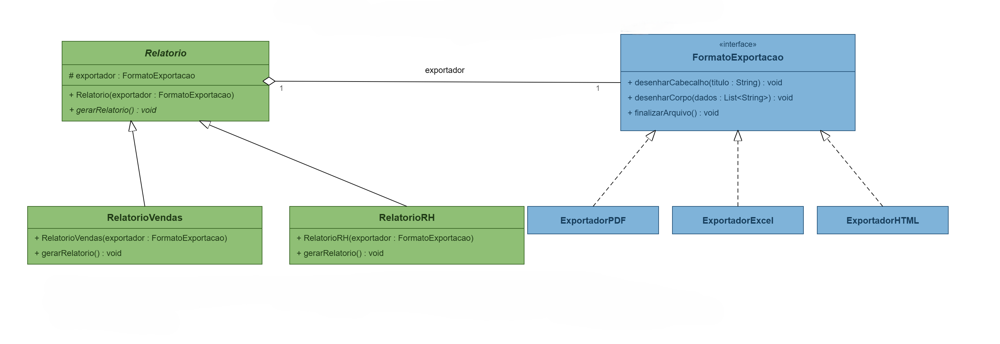
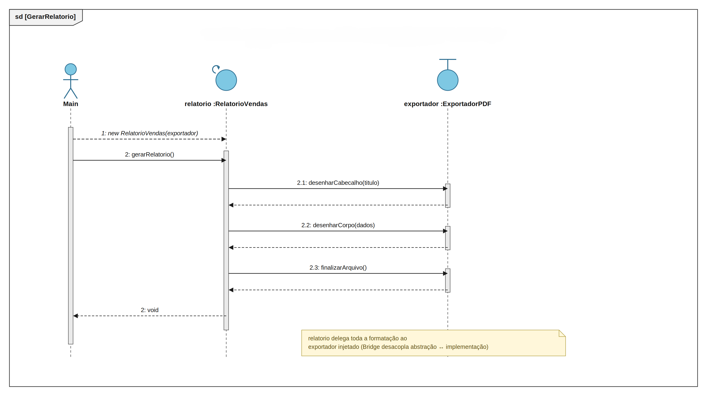

# Padrão Bridge - Módulo de Relatórios TechFatec

Projeto da disciplina de padrões de projeto. A ideia é pegar o módulo de relatórios de um sistema fictício, a TechFatec, e resolver um problema de escalabilidade usando o Padrão Bridge, em Java.

## O problema

O sistema legado só gerava um tipo de relatório, o de Vendas, e só em PDF. Aí apareceu um requisito novo: precisa de um relatório de RH também, e agora todos os relatórios (os que já existem e os que vierem depois) têm que poder sair em PDF, Excel e HTML.

Se eu resolvesse isso criando uma subclasse pra cada combinação, tipo `RelatorioVendasPDF`, `RelatorioVendasExcel`, `RelatorioRHHTML` e assim por diante, já ia dar seis classes só com dois relatórios e três formatos. E cada relatório ou formato novo multiplica esse número de novo. É a explosão de subclasses que o Bridge existe pra evitar.

## Como o Bridge resolve isso

O Bridge separa o que o relatório é (a abstração) de como ele é exportado (a implementação), e liga os dois lados por uma agregação, que funciona como ponte. Cada lado evolui sozinho: em vez de 2 x 3 = 6 classes, fico com 2 + 3 = 5, e adicionar um relatório ou um formato novo é só criar uma classe a mais, sem mexer em nada que já existe.

Do lado da abstração está `Relatorio`, que é abstrata, e as abstrações refinadas `RelatorioVendas` e `RelatorioRH`, todas em `src/abstracao`. Do lado da implementação está a interface `FormatoExportacao` e os implementadores concretos `ExportadorPDF`, `ExportadorExcel` e `ExportadorHTML`, em `src/implementacao`. Quem amarra os dois lados é o cliente, a classe `Main`, em `src/cliente`.

Isso também cobre o princípio aberto/fechado do SOLID: pra criar um relatório financeiro ou um exportador CSV amanhã, basta escrever uma classe nova, sem alterar as existentes.

Sobre a injeção de dependência: `Relatorio` recebe o exportador pelo construtor e nunca instancia um exportador concreto com `new`. Quem faz isso é o cliente. Também dá pra trocar o exportador em tempo de execução com `setExportador(...)`, sem precisar recriar o objeto do relatório.


## Diagrama de classes



O losango vazio entre `Relatorio` e `FormatoExportacao` indica agregação o relatório tem um exportador, mas o exportador existe independente dele e pode ser trocado. O diagrama mostra só o construtor por simplicidade, mas no código `Relatorio` também tem o `setExportador(...)`, usado no passo 2 do `Main` pra trocar o formato do relatório de vendas em tempo de execução.

## Diagrama de sequência



O `Main` cria o `RelatorioVendas` passando o exportador no construtor e chama `gerarRelatorio()`. Dali em diante quem conduz é o próprio relatório: ele chama `desenharCabecalho`, `desenharCorpo` e `finalizarArquivo` no exportador, e só devolve o controle pro `Main` no fim. O relatório não sabe formatar nada, ele delega tudo pro exportador que recebeu injetado.

## O que o Main faz e o que ele imprime

O cliente roda três rotinas: gera o relatório de Vendas em PDF, troca esse mesmo relatório pra Excel em tempo de execução com `setExportador`, e por fim gera o relatório de RH em HTML. Os exportadores simulam a exportação imprimindo no console, já que o foco do exercício é o desacoplamento do padrão, não a geração real dos arquivos.

```
=== 1) Relatorio de Vendas em PDF ===
[PDF] Cabecalho: RELATORIO DE VENDAS
[PDF] Pagina 1 | Produto A - 120 unidades - R$ 12.000,00
[PDF] Pagina 1 | Produto B - 80 unidades - R$ 9.600,00
[PDF] Pagina 1 | Total do mes: R$ 21.600,00
[PDF] Arquivo relatorio.pdf finalizado.

=== 2) Mesmo Relatorio de Vendas alterado em runtime para Excel ===
[XLSX] Planilha criada | Celula A1: Relatorio de Vendas
[XLSX] Celula A2: Produto A - 120 unidades - R$ 12.000,00
[XLSX] Celula A3: Produto B - 80 unidades - R$ 9.600,00
[XLSX] Celula A4: Total do mes: R$ 21.600,00
[XLSX] Arquivo relatorio.xlsx finalizado.

=== 3) Relatorio de RH em HTML ===
[HTML] <html><body><h1>Relatorio de Desempenho de RH</h1>
[HTML] <ul>
[HTML]   <li>Equipe Desenvolvimento - Meta atingida: 95%</li>
[HTML]   <li>Equipe Suporte - Meta atingida: 88%</li>
[HTML]   <li>Turnover trimestral: 3,2%</li>
[HTML] </ul>
[HTML] </body></html> | Arquivo relatorio.html finalizado.
```

No segundo bloco dá pra ver que os dados continuam os mesmos, só muda a formatação, porque o que trocou foi o exportador, não o relatório.

## O que isso trouxe de vantagem

No fim das contas ficaram cinco classes no lugar de seis, dá pra estender criando classe nova sem alterar as existentes, `Relatorio` depende só da interface `FormatoExportacao` e não de nenhuma implementação concreta, e o formato pode mudar em tempo de execução sem recriar o relatório.
