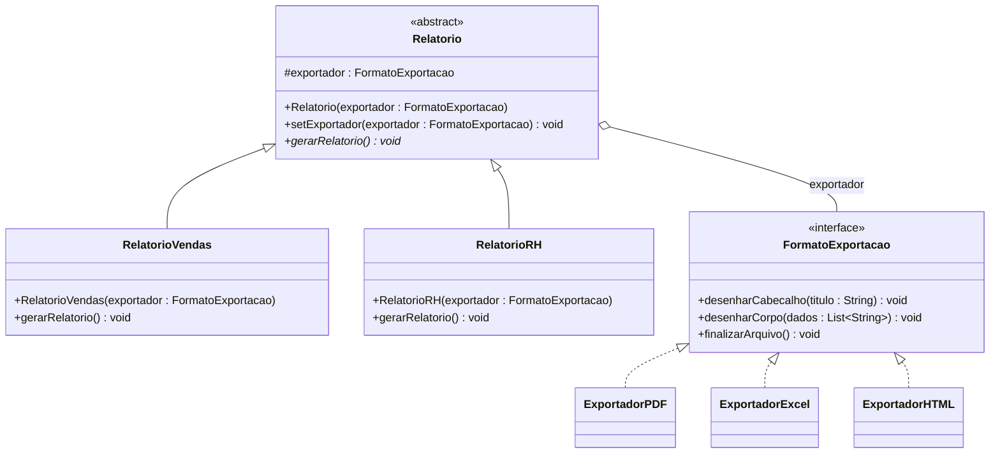
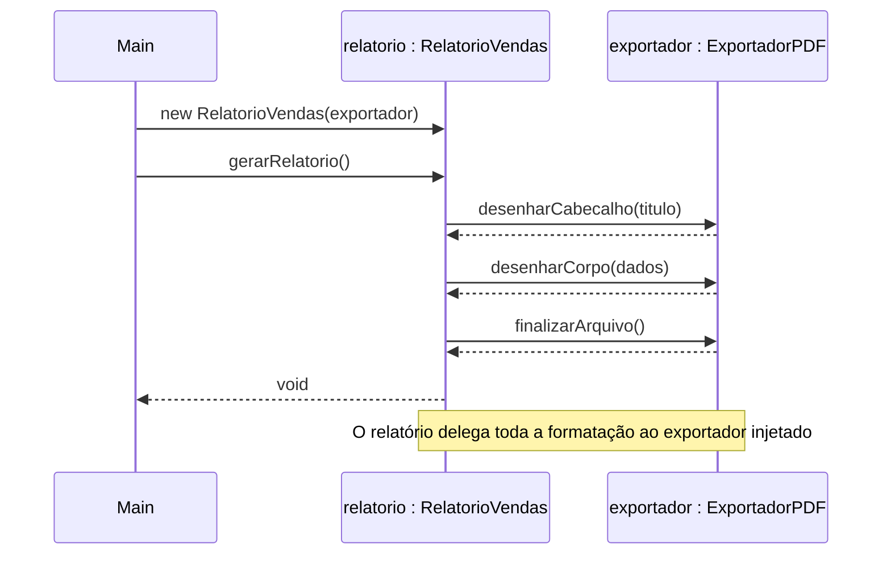

# Padrão Bridge — Módulo de Relatórios TechFatec

Projeto da disciplina de padrões de projeto: módulo de relatórios do sistema de inteligência de negócios **TechFatec**, modelado e implementado com o **Padrão Bridge** (Java).

## 1. Problema

O sistema legado gerava apenas o **Relatório de Vendas** em **PDF**. O novo requisito adiciona o **Relatório de Desempenho de RH** e exige que todos os relatórios (atuais e futuros) sejam exportáveis em **PDF, Excel (XLSX) e HTML**.

Sem o Bridge, cada combinação viraria uma subclasse (`RelatorioVendasPDF`, `RelatorioVendasExcel`, `RelatorioRHHTML`...): **2 relatórios × 3 formatos = 6 classes**, e cada novo relatório ou formato multiplicaria esse número (explosão de subclasses).

## 2. Solução: Bridge

O Bridge separa **o que** o relatório é (abstração) de **como** ele é exportado (implementação), ligando os dois lados por uma "ponte" (agregação). Cada lado evolui de forma independente: **2 + 3 = 5 classes**, e adicionar um relatório ou um formato é só criar 1 classe nova.

| Papel no Bridge | Classe / Interface | Pasta |
|---|---|---|
| Abstração | `Relatorio` (abstrata) | `src/abstracao/` |
| Abstração refinada | `RelatorioVendas`, `RelatorioRH` | `src/abstracao/` |
| Implementador | `FormatoExportacao` (interface) | `src/implementacao/` |
| Implementadores concretos | `ExportadorPDF`, `ExportadorExcel`, `ExportadorHTML` | `src/implementacao/` |
| Cliente | `Main` | `src/cliente/` |

### Princípio Aberto/Fechado (SOLID)

Novo relatório (ex.: `RelatorioFinanceiro`) ou novo formato (ex.: `ExportadorCSV`) = **criar uma classe nova**, sem modificar nenhuma classe existente.

### Injeção de dependência

`Relatorio` recebe o exportador **pelo construtor** e nunca usa `new` com um exportador concreto. Quem cria os exportadores e os injeta é o cliente (`Main`). Também é possível trocar o exportador em tempo de execução com `setExportador(...)`.

## 3. Estrutura de diretórios

```
Bridge-/
├── README.md
├── docs/
│   ├── classesdiagr.png
│   └── Diagrama_Sequencia_Bridge.png
└── src/
    ├── abstracao/
    │   ├── Relatorio.java
    │   ├── RelatorioVendas.java
    │   └── RelatorioRH.java
    ├── implementacao/
    │   ├── FormatoExportacao.java
    │   ├── ExportadorPDF.java
    │   ├── ExportadorExcel.java
    │   └── ExportadorHTML.java
    └── cliente/
        └── Main.java
```

## 4. Diagrama de classes


Versão textual (Mermaid), atualizada com o `setExportador` usado na troca em tempo de execução:



O losango vazio (`o--`) indica **agregação**: o relatório *tem um* exportador, mas o exportador existe independentemente dele e pode ser compartilhado ou trocado.

## 5. Diagrama de sequência




## 6. Como compilar e executar

Requisito: JDK 11 ou superior.

**Windows (PowerShell / CMD) ou Linux/macOS**, a partir da raiz do projeto:

```bash
javac -encoding UTF-8 -d out src/abstracao/*.java src/implementacao/*.java src/cliente/*.java
java -cp out cliente.Main
```

> No PowerShell, se o `*.java` não expandir, liste os arquivos manualmente ou use:
> `javac -encoding UTF-8 -d out (Get-ChildItem -Recurse src -Filter *.java).FullName`

## 7. Script de validação (`Main`) e saída esperada

O cliente executa três rotinas:

1. **Relatório de Vendas em PDF**
2. **Mesmo** Relatório de Vendas alterado **em tempo de execução** para **Excel** (`setExportador`)
3. **Relatório de RH em HTML**

```
=== 1) Relatorio de Vendas em PDF ===
[PDF] Cabecalho: RELATORIO DE VENDAS
[PDF] ------------------------------
[PDF] Pagina 1 | Produto A - 120 unidades - R$ 12.000,00
[PDF] Pagina 1 | Produto B - 80 unidades - R$ 9.600,00
[PDF] Pagina 1 | Total do mes: R$ 21.600,00
[PDF] Arquivo relatorio.pdf finalizado.

=== 2) Mesmo Relatorio de Vendas alterado em runtime para Excel ===
[XLSX] Planilha criada | Celula A1: Relatorio de Vendas
[XLSX] Celula A2: Produto A - 120 unidades - R$ 12.000,00
[XLSX] Celula A3: Produto B - 80 unidades - R$ 9.600,00
[XLSX] Celula A4: Total do mes: R$ 21.600,00
[XLSX] Arquivo relatorio.xlsx finalizado.

=== 3) Relatorio de RH em HTML ===
[HTML] <html><body><h1>Relatorio de Desempenho de RH</h1>
[HTML] <ul>
[HTML]   <li>Equipe Desenvolvimento - Meta atingida: 95%</li>
[HTML]   <li>Equipe Suporte - Meta atingida: 88%</li>
[HTML]   <li>Turnover trimestral: 3,2%</li>
[HTML] </ul>
[HTML] </body></html> | Arquivo relatorio.html finalizado.
```

Os exportadores simulam a geração imprimindo no console (o foco da atividade é o desacoplamento do padrão, não a geração real dos arquivos).

## 8. Vantagens obtidas

- **Sem explosão de subclasses:** 2 relatórios + 3 formatos = 5 classes (e não 6).
- **Aberto/Fechado:** extensão por novas classes, sem alterar as existentes.
- **Desacoplamento:** `Relatorio` depende só da interface `FormatoExportacao` (inversão de dependência).
- **Flexibilidade em runtime:** o formato pode mudar sem recriar o relatório.
